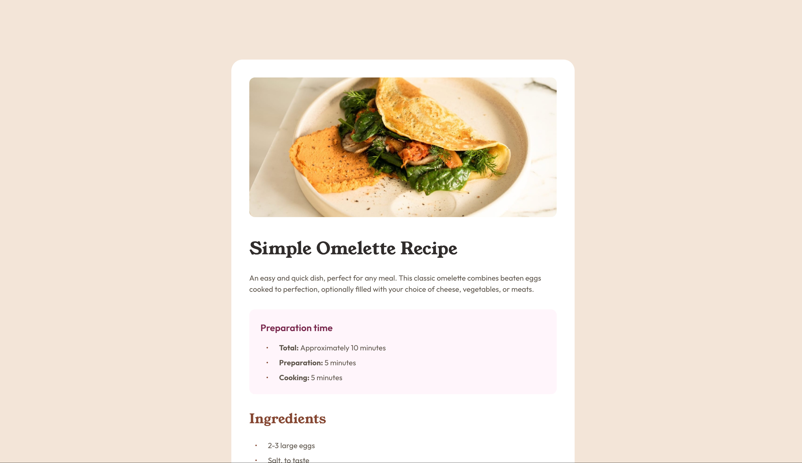

This is a solution to the [Recipe page challenge on Frontend Mentor](https://www.frontendmentor.io/challenges/recipe-page-KiTsR8QQKm). Frontend Mentor challenges help you improve your coding skills by building realistic projects. 

## Table of contents

- [Overview](#overview)
  - [The challenge](#the-challenge)
  - [Screenshot](#screenshot)
  - [Links](#links)
- [My process](#my-process)
  - [Built with](#built-with)
  - [What I learned](#what-i-learned)
  - [Continued development](#continued-development)
  - [Useful resources](#useful-resources)
- [Author](#author)

## Overview

### Screenshot

### Links

- Solution URL: [FM-2407-recipe-page-main](https://github.com/Cinquantesix/FM-2407-recipe-page-main)
- Live Site URL: [FM-2407-recipe-page-main](https://fm-2407-recipe-page-main.netlify.app/)

## My process

### Built with

- Semantic HTML5 markup
- CSS custom properties
- Flexbox

### What I learned

I learn a little about table. I don't really like it… I think it's too difficult beside what we can now do in CSS.

I also learn a lot about list and how style items. For simple use we have `::marker` and for the `ol` we can use `counters` to have better style. 

### Continued development

I think I need to practice more table and list to know better how to style them. In this exemple, the table is not very responsive, I think there is a serious challenge below this kind of work…

### Useful resources

- [CSS ::marker](https://developer.mozilla.org/en-US/docs/Web/CSS/::marker)
- [CSS counters](https://blog.logrocket.com/styling-numbered-lists-with-css-counters/)

## Author

- Website - [cinquantesix](https://cinquantesix.ch)
- Frontend Mentor - [@Cinquantesix](https://www.frontendmentor.io/profile/Cinquantesix)